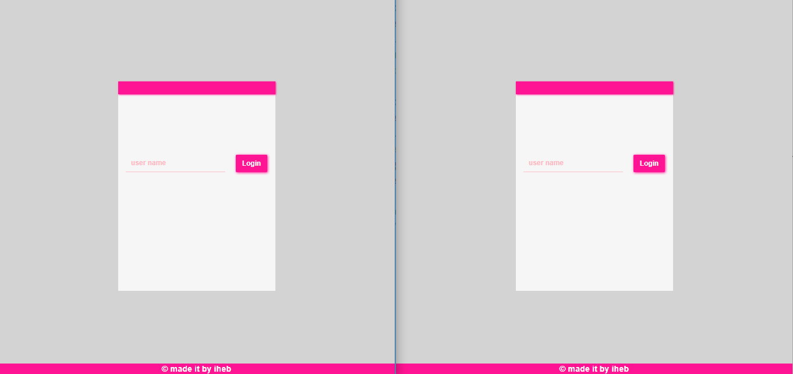
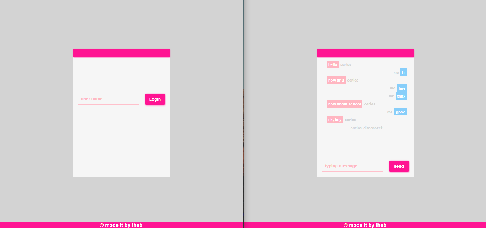

# socket.io-Chat-App

<h4> this little app allows you to chat with anyone else from different desktop and smart-phone. </h4>
<h3>------------- witch languages ,framework and library used to build the app ? -------------<h3>

  i used 
   nodejs, expressjs 
   to build the app and a small library called socket.io enables real-time  bidirectional and event-based communication. and of course i used  ❤️️, cause always i'd rather to design my websites without using any framework to make my websites more beatiful 😍 and be more creative 😎.

<h2>---------- How Look Is The App? ----------</h2>

<h4> 1. Login in ( Enter Your Name And Login in) </h4>

<h4> 2. Connected ( When New Guest Join To The Room, The Server Will Send An Alert As You See In The Pictures ) </h4>

<h4> 3. Chat up ( When You Logged In, Now You Can Chat With The People They Logged before.) </h4>

<h4> 4. Typing a message ( When Your Friend Is Typing A Message Will Appear To You An Alert To Tell You That The Other Guest Is Typing. ) </h4>

<h4> 5. Disconnect ( When Your Friend Disconnected Will Appear To You An Alert To Tell You Who Is Disconnected. ) </h4>

